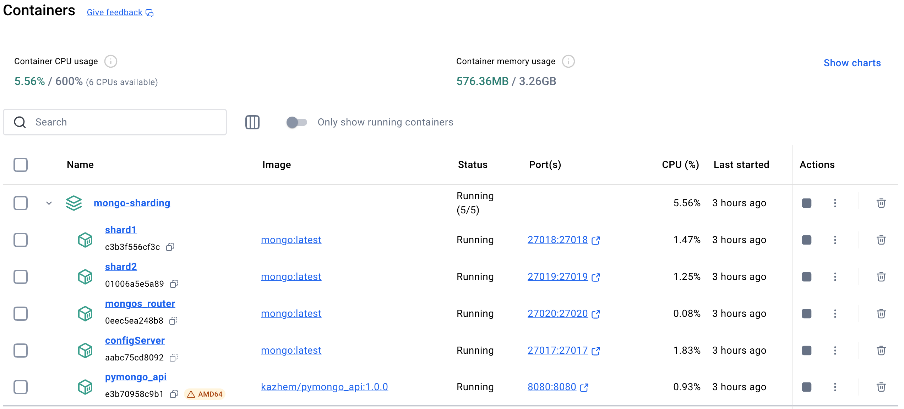
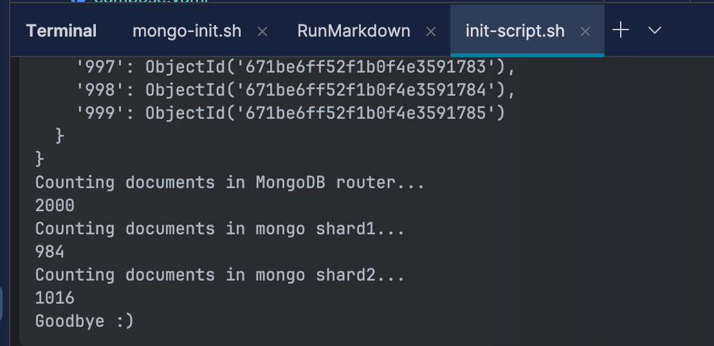

# pymongo-api - приложение с шардированием mongodb

## Как запустить (на IDEA for Mac)

Запускаем mongodb и приложение

```shell
docker compose up -d
```



Запускаем скрипт

```shell
chmod +x scripts/init_sharding.sh
./scripts/init_sharding.sh
```

результат запуска



## Как проверить

### Если вы запускаете проект на локальной машине

Откройте в браузере http://localhost:8080

### Если вы запускаете проект на предоставленной виртуальной машине

Узнать белый ip виртуальной машины

```shell
curl --silent http://ifconfig.me
```

Откройте в браузере http://<ip виртуальной машины>:8080

## Доступные эндпоинты

Список доступных эндпоинтов, swagger http://<ip виртуальной машины>:8080/docs