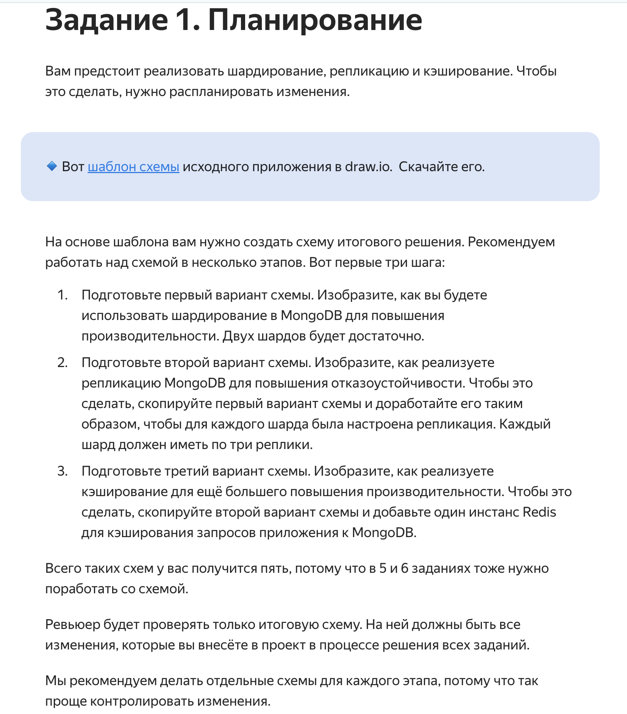

# Шардирование и реплицкация - сприн 2 (Курс Яндекса по архитектуре)

## Задание - общая концепция



Общие правила:

1. В каждом каталоге/задании (mongo-sharding, mongo-sharding-repl и sharding-repl-cache) 
есть файл Readme_*** с описанием как запускать приложения и скриптами запуска
2. Я сделал в скриптах .sh переменную INIT_MODE
Если переменная установлена как TRUE - мы инициализируем докер и всю конфигурацию, 
если false - проверяем работу приложения (например, что пользователи распределись по шардам)

3. учитывайте этот факт при запуске

## Задание 1 и 2 - Планирование и делаем 2 шарда MongoDB

Скрипт

```shell
./mongo-sharding/scripts/init-sharding.sh
```

Схема ниже:

```
./mongo-sharding/arh-sprint2-1.drawio
```
***

## Задание 3 - делаем 2 шарда MongoDB c репликами

Скрипт

```shell
./mongo-sharding-repl/scripts/init-shardingrepl.sh
```

Схема ниже:

```
./mongo-sharding/arh-sprint2-2.drawio
```

*** 

## Задание 4 - кеширование

Скрипт для запуска

```shell
./sharding-repl-cache/scripts/init-shardingreplcache.sh
```
Схема ниже:

```
./sharding-repl-cache/arh-sprint2-3.drawio
```
проверка работи кеша есть внутри каталога в файле /sharding-repl-cache/Readme*...

***

## Задание 5 - Service Discovery и балансировка с API Gateway

Схема ниже (вкладка 5):

```
./arh-sprint2-56.drawio
```

***
## Задание 6 - CDN

Схема ниже (вкладка 6):

```
./arh-sprint2-56.drawio
```

***
##
##
##
##

---оставил из изначального файла
## Как проверить

### Если вы запускаете проект на локальной машине

Откройте в браузере http://localhost:8080

### Если вы запускаете проект на предоставленной виртуальной машине

Узнать белый ip виртуальной машины

```shell
curl --silent http://ifconfig.me
```

Откройте в браузере http://<ip виртуальной машины>:8080

## Доступные эндпоинты

Список доступных эндпоинтов, swagger http://<ip виртуальной машины>:8080/docs