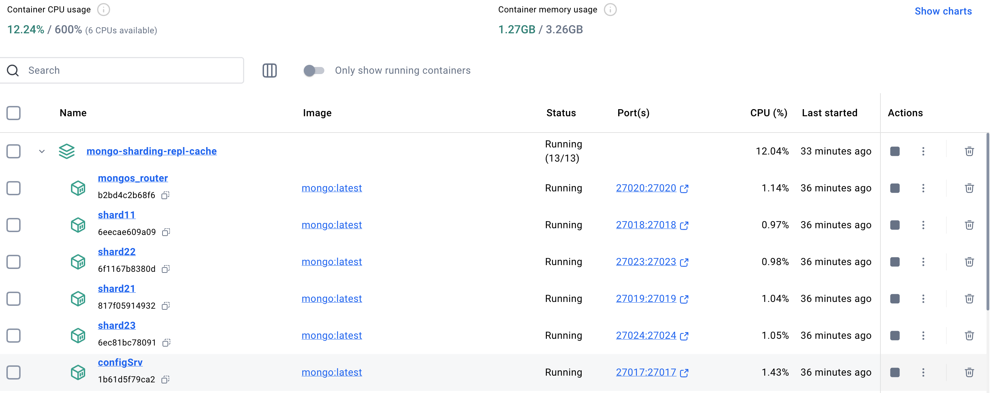
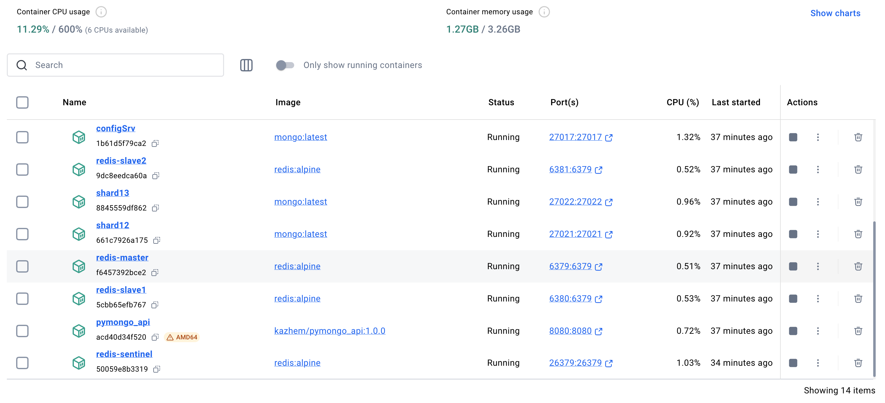
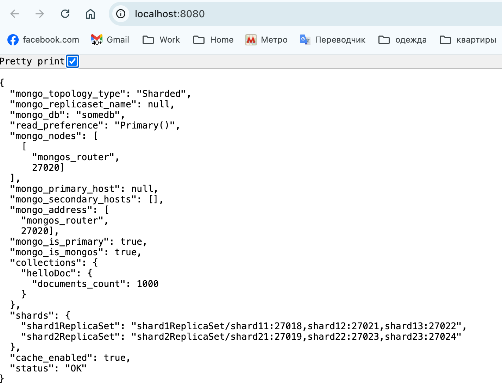
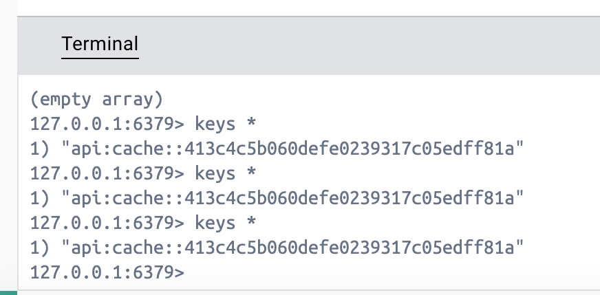
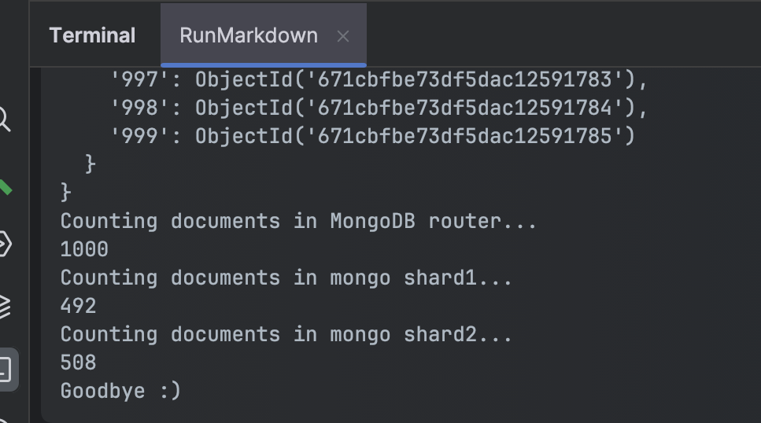

# pymongo-api - приложение с шардированием, репликацией mongodb  и кешем redis

## Как запустить (на IDEA for Mac)

Запускаем скрипт

```shell
chmod +x scripts/init_shardingreplcache.sh
scripts/init_shardingreplcache.sh
```

результат запуска





## Как проверить

### Если вы запускаете проект на локальной машине

Откройте в браузере http://localhost:8080

ниже по ссылке



также ниже результаты работа кеша из консоли



и распределения по шардам



### Если вы запускаете проект на предоставленной виртуальной машине

Узнать белый ip виртуальной машины

```shell
curl --silent http://ifconfig.me
```

Откройте в браузере http://<ip виртуальной машины>:8080

## Доступные эндпоинты

Список доступных эндпоинтов, swagger http://<ip виртуальной машины>:8080/docs